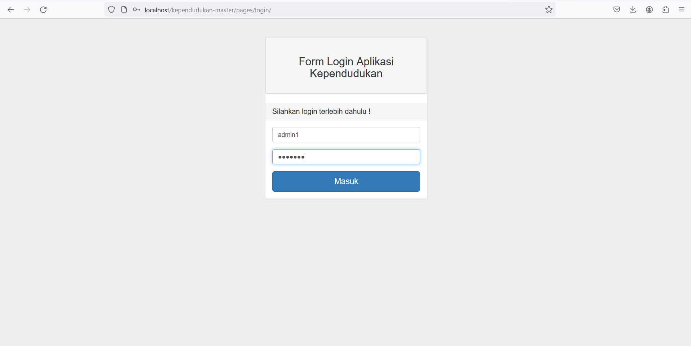
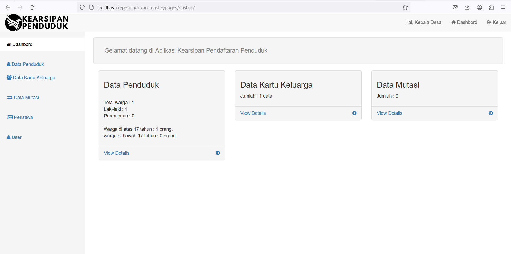
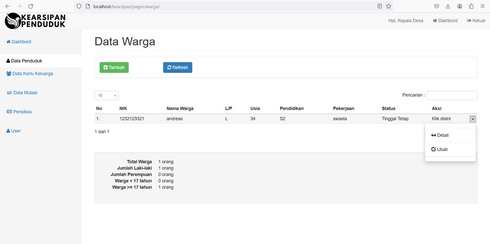
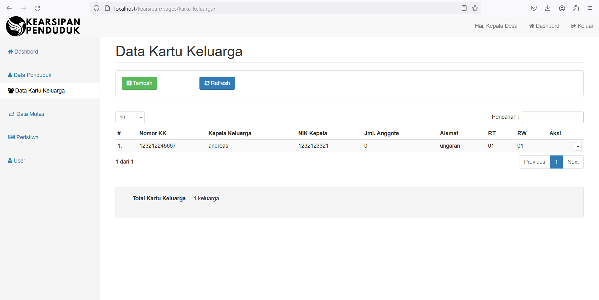
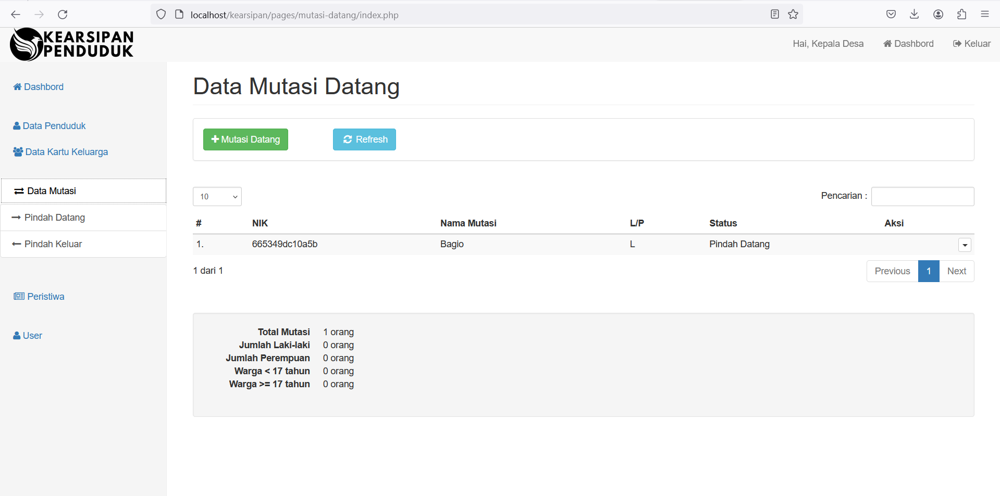
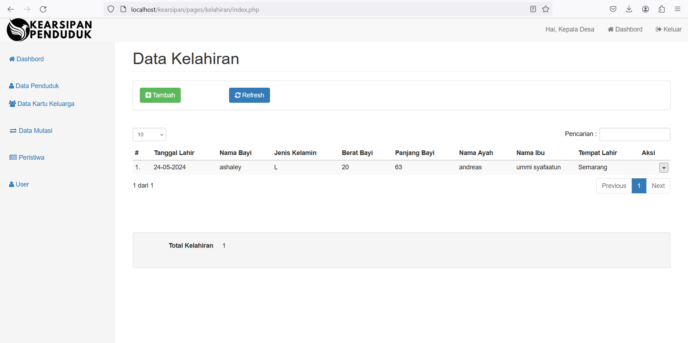

# Kearsipan Data Penduduk

Website ini berisikan tentang kearsipan penduduk, seperti halnya pemerintah yang sedang menginput data para warga untuk di arsipkan dan di data agar mengetahui siapa saja warganya dan berapa jumlahnya. dimana skemanya yaitu : 
 
 
<ul>
<li>Pertama login terlebih dahulu sebagai Admin, di sini role nya hanya Admin atau pihak perangkat desa / DUKCAPIL</li>
<li>Jika sudah, maka akan diarahkan ke halaman Dashboard, dimana di dalam dashboard berisikan fitur untuk : melihat, mencari, membuat, dan menghapus data penduduk. mutasi penduduk, serta kelahiran dan kematian warga.</li>
<li>Dalam pengisian data dianjurkan untuk membawa ktp dan kk karena data di dalam database berisi data dari KTP dan KK</li>
<li>Dalam web ini masih dalam tahap pengembangan karena terdapat beberapa data yang belum dimasukkan dan hanya menggunakan 1 role saja yaitu admin</li>
<li>Kedepannya akan ada versi untuk user agar user tidak perlu datang lagi ke kantor untuk input data</li>
</ul>

# Berikut adalah tampilan dari website saya

<h3>Halaman LogIn</h3>

 
<h3>Halaman Dashboard</h3>

 
<h3>Halaman Data Penduduk</h3>

 
<h3>Halaman Data Kartu Keluarga</h3>

 
<h3>Halaman Data Mutasi</h3>

 
<h3>Halaman Data Kelahiran</h3>
